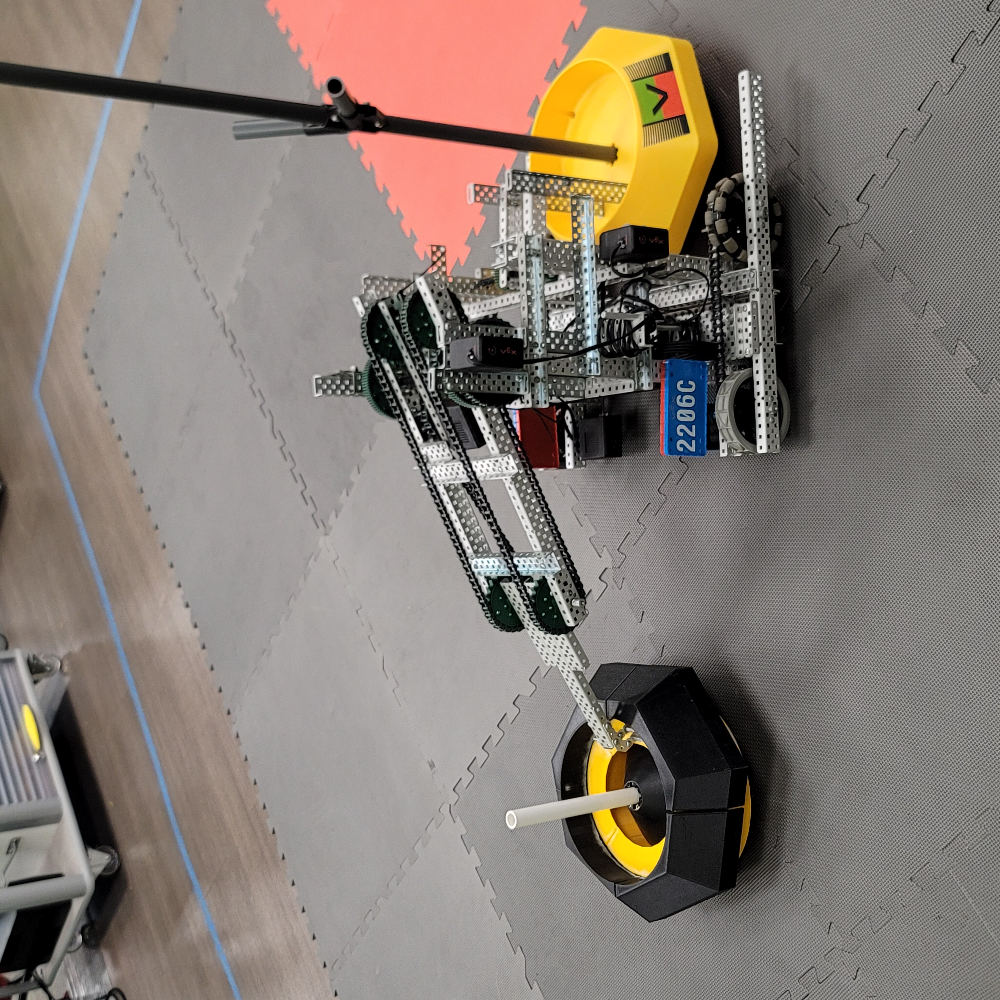

# Clawbot 1

Moderator: Carlos J. Cobian

Mechanical Team:
* Rafael Torres

Programming Team:
* Hugo Cordova

 

### Design:

 

Forklift-1 excells at mobile goal control thanks to its hooked arm and clip. On one side we have the clip, which fastens a mobile goal to the robot, allowing Forklift-1 to move about without having to worry about the goal being left behind. At the top we have the arm, which can be used to both pull bases and pick up rings. The arm has reach at either sides of the robot, which allows Forklift-1 to move around two mobile goals at once, put rings on the goal held by the clip, and push down on the tipping point.
