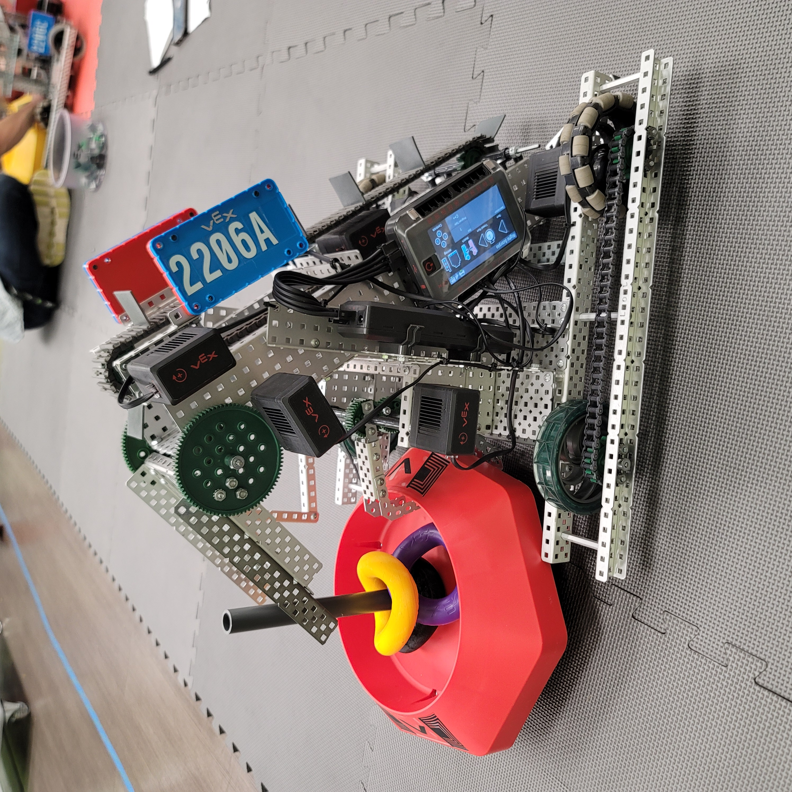

# Fusion 1

Moderator: Carlos J. Cobian
Last Edited: February 18, 2022

Mechanical Team:
* Rafael Torres
* Mario Sanchez
* 

Programming Team:
* Luis Umpierre
* Rafael Torres

 

## Design:

<!-- 
<!--         title="Scorpio" -->
<!--         width="60%" -->
<!--         height="60%"   /> -->

 

Fusion was designed with the goal of picking up and moving mobile goals as optimally as possible. With the forklift apparatus at the front, Fusion is capable of quickly lifting mobile goals off the ground and putting them on top of the tipping point. Additionally, the robot has a clip at the back that allows it to drag around a second base. The design is meant for a quick in-and-out strategy, where the driver steals mobile goals from the opposing team in order to score them.

 

## Specifications:

 

### Mechanical Components:

 
<!-- Describe the motors, gear ratios, and gear cartridges -->
 

| Motor | Function |
|-------|-------------|
| 16 | Left DriveTrain 18:1 |
| 15 | Right DriveTrain 18:1 |
| 18 | Left Arm 18:1 |
| 14 | Rigth Arm 18:1 |
| 17 | Clip 18:1 |
| 19 | Elbow 18:1 | 
| 13 | Elbow 18:1 |

 

### Structural Components:

 
<!-- Describe the different apparatuses, parts, function -->
 

| Structure | Function |
|-------|-------------|
| Drivetrain | Move robot |
| Clip | Grab a mobile goal |
| Arm | Lift mobile goal |
| Elbow | Hold mobile goal |

 
